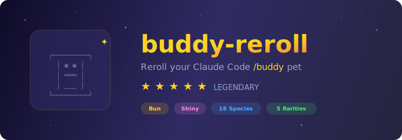

<p align="center">
  
</p>

# buddy-reroll

Reroll your Claude Code `/buddy` pet until you get the perfect one.

> Claude Code 2.1.89+ generates a deterministic pet from your identity hash. This tool brute-forces IDs to find your dream companion — legendary, shiny, specific species, whatever you want.

## How it works

```
seed = hash(identifier + SALT) → Mulberry32 PRNG → species, rarity, stats, hat, eyes, shiny
```

**Identity priority** (this is the key):
```
oauthAccount.accountUuid  →  userID  →  "anon"
        ↑ most users               ↑ legacy/offline
```

> **If you're logged in (most people), changing `userID` does nothing.** You need to change `accountUuid`.

**18 species**: duck · goose · blob · cat · dragon · octopus · owl · penguin · turtle · snail · ghost · axolotl · capybara · cactus · robot · rabbit · mushroom · chonk

**5 rarities**: ★ common (60%) · ★★ uncommon (25%) · ★★★ rare (10%) · ★★★★ epic (4%) · ★★★★★ legendary (1%)

**Extras**: 6 eye styles · 8 hats (crown/tophat/propeller/halo/wizard/beanie/tinyduck) · 5 stats · 1% shiny chance

## Requirements

**Bun is required.** Node.js uses FNV-1a hashing which does NOT match Claude Code's `Bun.hash()`.

```bash
curl -fsSL https://bun.sh/install | bash
```

## Usage

### 1. Check your current buddy

```bash
# Find your identifier in ~/.claude.json:
#   OAuth user → oauthAccount.accountUuid (UUID format)
#   Non-OAuth  → userID (hex string)

bun buddy-reroll.js check <your-accountUuid-or-userID>
```

### 2. Reroll

```bash
# Legendary (any species) — OAuth user (UUID format)
bun buddy-reroll.js reroll "" 5000000 3 --uuid

# Legendary dragon — non-OAuth user (hex format)
bun buddy-reroll.js reroll dragon 5000000 3

# Shiny legendary capybara (the holy grail)
bun buddy-reroll.js reroll capybara 50000000 1 --shiny --uuid
```

| Flag | Description |
|------|-------------|
| `--uuid` | Generate UUID v4 IDs (for OAuth users with `accountUuid`) |
| `--shiny` | Only match shiny companions (1% of legendaries) |

### 3. Apply

1. Copy the `uid` from the output
2. Edit `~/.claude.json`:

   **OAuth user** (most people):
   ```jsonc
   "oauthAccount": {
     "accountUuid": "PASTE-YOUR-NEW-UUID-HERE",  // ← change this
     // ... keep everything else
   }
   ```

   **Non-OAuth user**:
   ```jsonc
   "userID": "paste-your-new-hex-here"  // ← change this
   ```

3. Delete the `"companion"` block if it exists (name + personality + hatchedAt)
4. Restart Claude Code
5. Run `/buddy` to meet your new pet

## Example

```
$ bun buddy-reroll.js reroll capybara 50000000 1 --shiny --uuid

Searching: legendary capybara (UUID format), max 50,000,000 iterations, find 1

--- #1 ---
  Species : capybara
  Rarity  : legendary ★★★★★
  Eye     : ✦
  Hat     : crown
  Shiny   : true
  Stats   :
    DEBUGGING  █████████████████░░░ 87
    PATIENCE   ██████████░░░░░░░░░░ 50
    CHAOS      ██████████████░░░░░░ 74
    WISDOM     ████████████████████ 100
    SNARK      █████████████████░░░ 85
  uid     : 2810dbbc-4f33-461a-9aa6-afeb70f6f36c

Found 1 legendary in 28.1s
```

## FAQ

**Q: OAuth or non-OAuth — how do I tell?**
A: Open `~/.claude.json`. If you see `"oauthAccount"` with an `"accountUuid"` field, you're OAuth. Use `--uuid` and change `accountUuid`. If not, change `userID`.

**Q: Will this break anything?**
A: No. These IDs are only used for telemetry, A/B bucketing, and buddy generation. Your conversations, API keys, and settings are unaffected.

**Q: Can I get my old pet back?**
A: Yes — save your original `accountUuid` / `userID` before replacing it.

**Q: Why Bun and not Node.js?**
A: Claude Code is built with Bun. The hash function (`Bun.hash`, which is Wyhash) produces different results than Node's crypto hashes. If you use Node, the uid you roll will generate a completely different pet in Claude Code.

## How we found this

The companion generation was reverse-engineered from the Claude Code binary. Key discovery: **the identity priority chain is `oauthAccount.accountUuid ?? userID ?? "anon"`** — most guides only mention `userID`, which doesn't work for logged-in users.

Source analysis from the binary:
```javascript
// Actual code from claude.exe (deobfuscated):
function getCompanionSeed() {
  return oauthAccount?.accountUuid ?? userID ?? "anon"
}
// seed = Bun.hash(getCompanionSeed() + "friend-2026-401")
// rng  = mulberry32(seed)
```

## Credits

Original algorithm discovery by **nemomen** on [linux.do](https://linux.do/t/topic/1871870). OAuth `accountUuid` priority chain discovered via binary analysis.

## License

MIT
